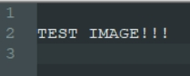

Markdown 실습
==================

# 1. Title 작성법
"="를 3개 연속으로 붙여서 표현하면 된다.

문법)

    Title
    ===


결과)

Title
===

---

# 2. 머리글
H1~H6까지만 지원

문법)

    # H1
    ## H2
    ### H3
    #### H4
    ##### H5
    ###### H6
    ####### H7

결과)
# H1
## H2
### H3
#### H4
##### H5
###### H6
####### H7

---

# 3. 앞머리 기호
"-", "*", "+"를 붙이고, 들여쓰기에 따라 앞머리 기호가 붙음.

문법)

    - 하하하
        - 하하하
            - 하하
                - 하하
    * code Block
        * code Block
            * code Block
                * code Block
    + 하하
        + 하하
            + 하하
                + 하하
결과)
- 하하하
    - 하하하
        - 하하
            - 하하
* code Block
    * code Block
        * code Block
            * code Block
+ 하하
    + 하하
        + 하하
            + 하하

---

# 4. Block Quote
블록 인용 텍스트로 ">"를 앞에 붙이고, 이게 많아질 수록 더 내부 블록이 된다.

문법)

    > Block1
    >> Block2
    >>> Block3 
    > # Test
    > Hellow

결과)
> Block1
>> Block2
>>> Block3
> # Test
> Hellow

---

# 5.  Code Block
들여쓰기를 하면 Code block으로 표시

문법1)

    Start

        Test
        gkgkgk

    End


결과1)

Start

    Test
    gkgkgk    

End

---

`또는 <pre><code>{code}</code></pre> 사용하는 방식`

문법2)
    
```
    <pre>
    <code>
    CodeBlock
    </code>
    </pre>
```
결과2)

<pre>
<code>
CodeBlock
</code>
</pre>

---

`또는 ``` 을 사용하는 방법`

문법3)
    
    ```
    하하하하하
    ```
결과3)

```
하하하하하
```

---

`github에서는 ```go 로 시작하면 해당 언어에 맞게 하이트라이트 됨`

문법4)
    
    ```go
    func Test(){
        fmt.Println("Test")
    }
    ```
결과4)
```go
func Test(){
    fmt.Println("Test")
}
```

---

# 6.  개행
문장 마지막에 space ___ 3번 입력하면 엔터 효과 

문법1)

    나는 사람 이다.   
    나는 축구를 좋아한다.

결과1)

나는 사람 이다.   
나는 축구를 좋아한다.

---

또는 개행하는 곳에

    <br>

을 사용해도 된다.

문법2)

    나는 사람 이다. 나는 <br> 축구를 좋아한다.
    
결과2)

나는 사람 이다. 나는 <br> 축구를 좋아한다.

---

# 7. 링크
참조 링크 :

사용 법   
[link keyword][id]  
[id]: URL "Optional Title here"   

문법) 

    Link: [Google][googlelink]

    [googlelink]: https://google.com "Go google"


결과)

Link: [Google][googlelink]

[googlelink]: https://google.com "Go google"

---

# 8. 강조

문법)

기울임

    *1*

    _하하하_

굵게

    __1__


    **하하**

결과)
기울임

*1*

_하하하_

굵게

__1__

**하하**

---

# 9. 표 만들기
## 일반적인 표
문자와 문자로 표를 만들 수 있다.

문법1)

    |제목|내용|설명|
    |------|---|---|
    |테스트1|테스트2|테스트3|
    |테스트1|테스트2|테스트3|
    |테스트1|테스트2|테스트3|

결과1)

|제목|내용|설명|
|------|---|---|
|테스트1|테스트2|테스트3|
|테스트1|테스트2|테스트3|
|테스트1|테스트2|테스트3|

## 정렬
셀 안에 문자를 정렬할 수 있다.

문법2)

    |제목|내용|설명|
    |:---|---:|:---:|
    |왼쪽 정렬|오른쪽 정렬|중앙 정렬|
    |왼쪽 정렬|오른쪽 정렬|중앙 정렬|
    |왼쪽 정렬|오른쪽 정렬|중앙 정렬|
 
 결과2)

|제목|내용|설명|
|:---|---:|:---:|
|왼쪽 정렬|오른쪽 정렬|중앙 정렬|
|왼쪽 정렬|오른쪽 정렬|중앙 정렬|
|왼쪽 정렬|오른쪽 정렬|중앙 정렬|

## 셀 확장
셀을 확장 할 수 있다.

문법3)

    |제목|내용|설명|
    |:---|:---:|---:|
    ||중앙에서확장||
    |||오른쪽에서 확장|
    |왼쪽에서확장||

결과3)

|제목|내용|설명|
|:---|:---:|---:|
||중앙에서확장||
|||오른쪽에서 확장|
|왼쪽에서확장|||

## 셀 강조
셀을 강조 할 수 있다.


문법4)


    |제목|내용|설명|
    |---|---|---|
    |테스트1|*강조1*|테스트3|
    |테스트1|**강조2**|테스트3|
    |테스트1|<span style="color:red">강조3</span>|테스트3|

결과4)

|제목|내용|설명|
|---|---|---|
|테스트1|*강조1*|테스트3|
|테스트1|**강조2**|테스트3|
|테스트1|<span style="color:red">강조3</span>|테스트3|

---

# 10. 이미지 넣기

문법)
    
    
    

결과)


이미지 사이 조정 해서 넣기

문법)

    </img><br/>

    </img>

결과)

</img><br/>

</img>

---